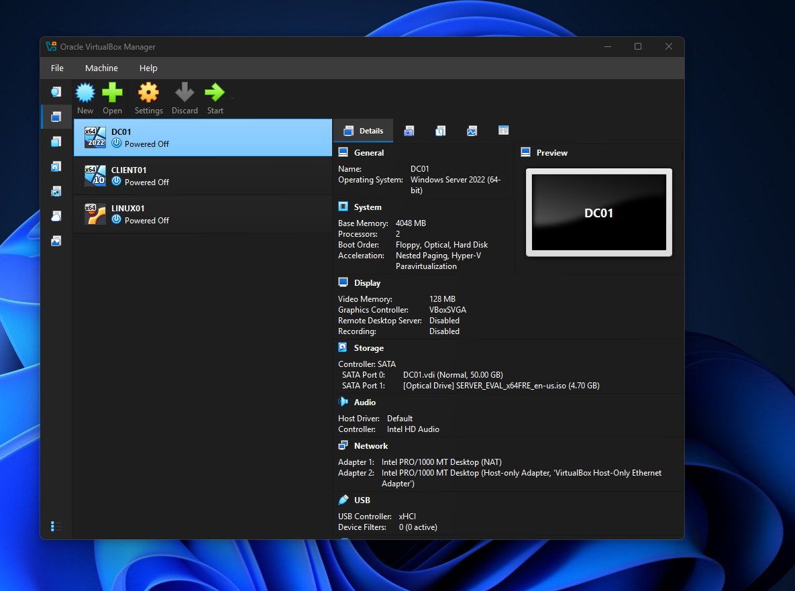
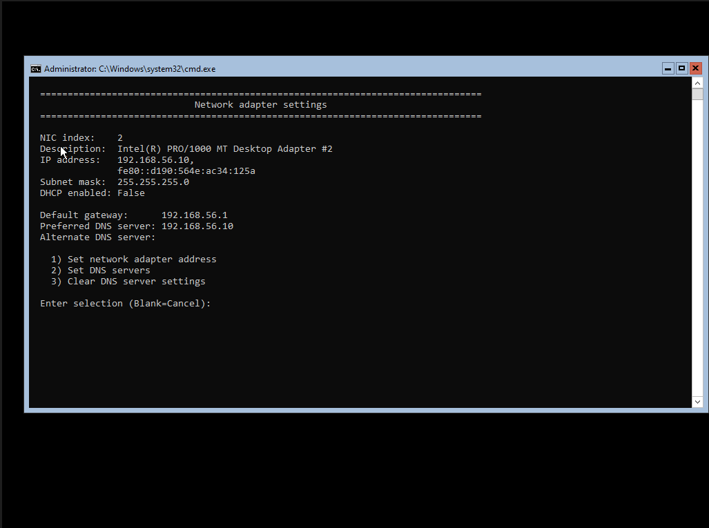
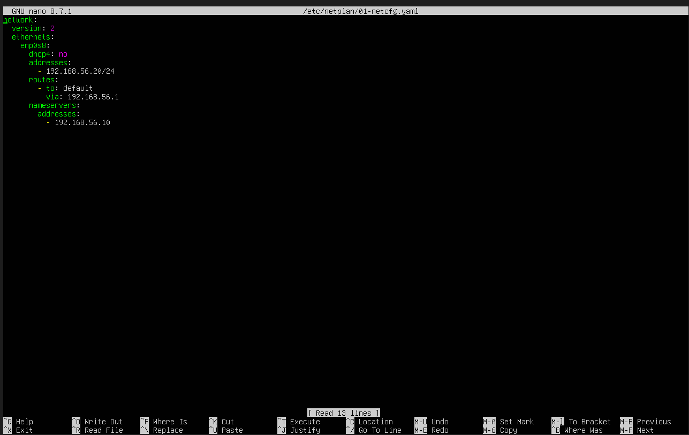
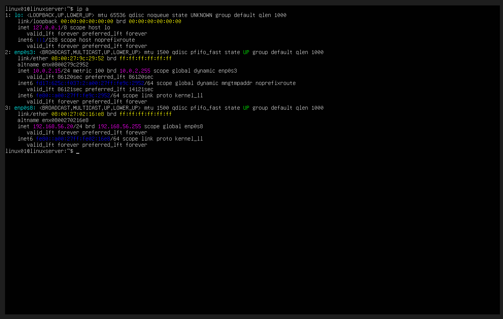
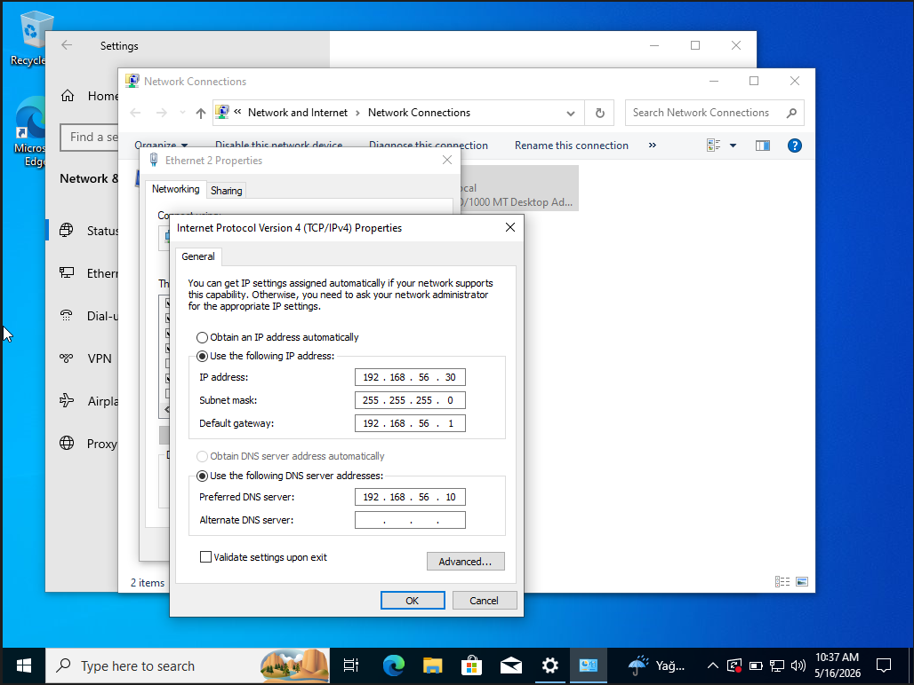
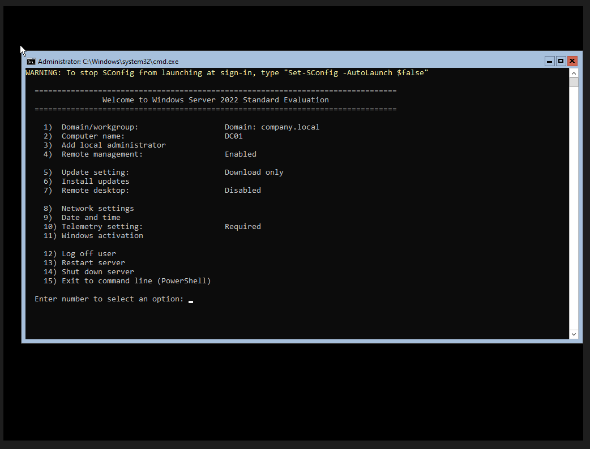
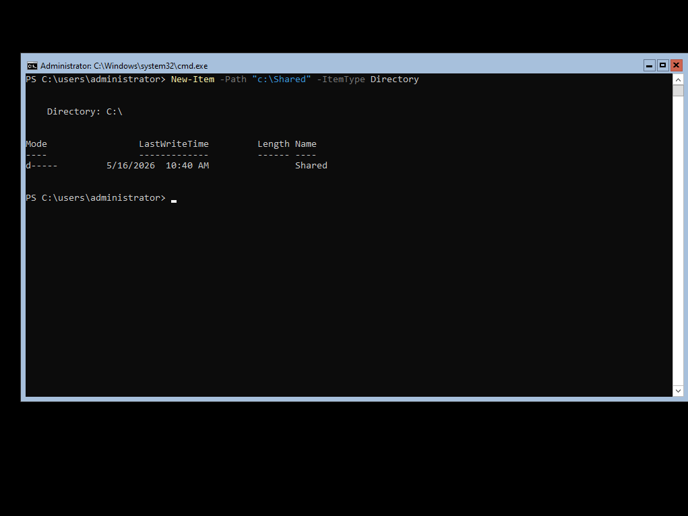
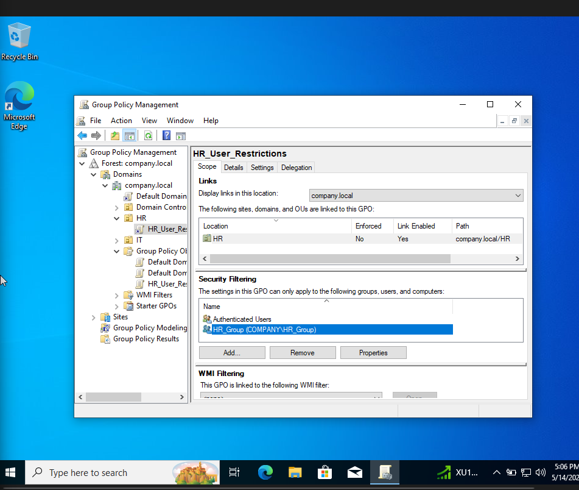
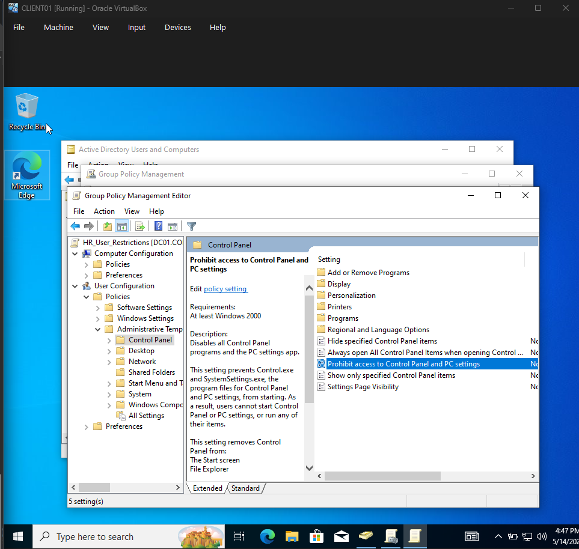
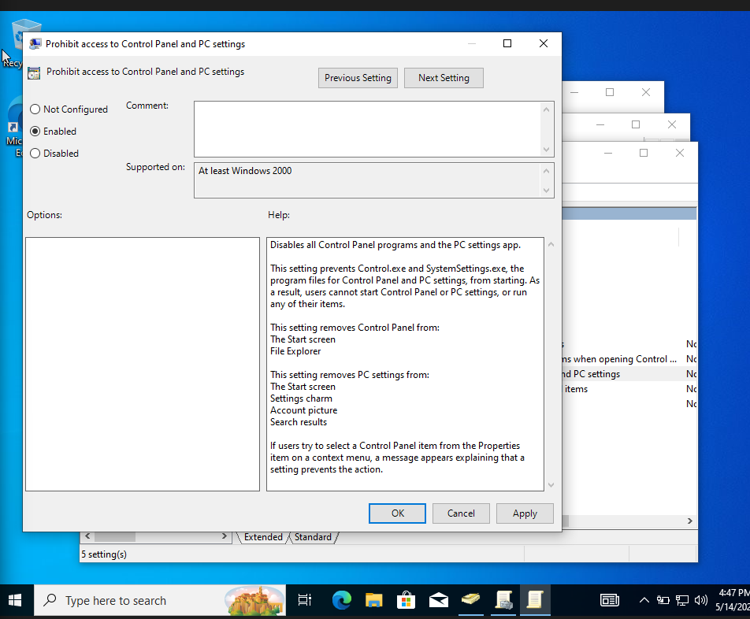

# Virtual Home Lab — Windows Server & Active Directory

A virtual home lab simulating a small-scale enterprise Windows environment. The core focus of this project is building and managing a **Domain Controller** and **DNS Server** from scratch using Windows Server 2022 Core, then layering Active Directory, Group Policy, user management, and access control on top of it — the same stack used in real enterprise environments.

Everything runs through DC01, which acts as the heart of the lab. Every other machine — whether Windows or Linux — depends on it for authentication, name resolution, and policy enforcement.

---

## Environment

| VM | OS | Role |
|---|---|---|
| DC01 | Windows Server 2022 Core | Domain Controller + DNS Server |
| CLIENT01 | Windows 10 Pro | Client Workstation |
| LINUX01 | Ubuntu Server | Linux Service Server |

All three virtual machines are configured and managed through Oracle VirtualBox.



**Network:** Each VM uses a NAT adapter for internet access and a Host-Only adapter for internal communication, mirroring how enterprise environments separate internal and external traffic.

**Static IPs:**

| VM | IP Address |
|---|---|
| DC01 | 192.168.56.10 |
| CLIENT01 | 192.168.56.20 |
| LINUX01 | 192.168.56.30 |

---

## Network Configuration

### DC01 — Static IP via Server Core

On DC01 (Windows Server Core), the static IP was configured through the built-in `sconfig` network menu. DHCP was disabled and the server was set to use itself as the preferred DNS server.



### LINUX01 — Static IP via Netplan

On the Ubuntu server, the static IP was configured by editing the Netplan configuration file at `/etc/netplan/01-netcfg.yaml`. DNS was pointed at DC01 (`192.168.56.10`) so the Linux server resolves domain names through the lab's own DNS server.



After saving the file, the configuration was applied with:

```bash
sudo netplan apply
```

The result was verified using:

```bash
ip a
```



### CLIENT01 — Static IP via Windows GUI

On CLIENT01, the static IP was set through the TCP/IPv4 adapter properties. DNS was pointed at `192.168.56.10` (DC01) so the workstation can locate the domain controller for authentication.



---

## Domain Controller

DC01 is the centerpiece of this entire lab. It runs **Windows Server 2022 Core** — no desktop GUI, no graphical tools. Every configuration is done through PowerShell and `sconfig`. This is intentional; Server Core is what you will find in hardened production environments because it has a smaller attack surface and lower resource overhead.

DC01 was promoted to a Domain Controller by installing the AD DS role and creating the forest:

```powershell
# Install the AD DS role with management tools
Install-WindowsFeature AD-Domain-Services -IncludeManagementTools

# Promote the server to Domain Controller and create the forest
Install-ADDSForest -DomainName "company.local"
```

**Domain:** `company.local`

The `sconfig` menu below confirms DC01 is operating as a domain controller joined to `company.local`. From here, all server management — network settings, remote access, updates — is handled without ever opening a GUI.



---

## DNS Server

DC01 also runs as the **DNS Server** for the entire lab. This is not optional — DNS is the foundation that Active Directory is built on. Without it, no client machine can locate the domain controller, authentication fails, and Group Policy cannot be applied.

Every machine in the lab points its DNS at DC01 (`192.168.56.10`):

- CLIENT01 DNS set to `192.168.56.10` via TCP/IPv4 properties
- LINUX01 DNS set to `192.168.56.10` via Netplan
- DC01 points to itself as the preferred DNS server

When a client logs into the domain, DNS resolves where `company.local` lives. When Group Policy is applied, DNS is what locates the domain controller to pull the policy from. It underpins every other feature in this lab — Active Directory, authentication, file sharing, and GPO all rely on it.

---

## Active Directory

With the Domain Controller and DNS in place, Active Directory was configured to organize and manage users, groups, and resources across the domain. AD was managed using:

```
dsa.msc — Active Directory Users and Computers
```

**Organizational Units:**
- HR
- IT

**Security Groups:**
- `HR_Group`
- `IT_Group`

Users are assigned to groups rather than having permissions applied to individual accounts, which keeps access control scalable and easy to manage as the environment grows.

---

## File Sharing & Permissions

A shared folder was created on DC01 to simulate company file access with role-based permissions.

```powershell
# Create the shared folder
New-Item -Path "c:\Shared" -ItemType Directory
```



| Group | Permission |
|---|---|
| IT_Group | Full Control |
| HR_Group | Read-Only |

Permissions were verified by logging in as users from each group and testing read, write, and delete access.

---

## Group Policy

Group Policy is where the Domain Controller really shows its value — instead of configuring each machine individually, settings and restrictions are pushed from DC01 to every machine in the domain automatically.

GPOs were created and linked to each OU to enforce department-level restrictions and centralized settings.

### HR_User_Restrictions GPO

A GPO named `HR_User_Restrictions` was created and linked to the HR OU. Security filtering was scoped specifically to `HR_Group` so the policy only applies to HR users.



### Control Panel Restriction

Inside the GPO, the **Prohibit access to Control Panel and PC settings** policy was enabled under:

`User Configuration > Policies > Administrative Templates > Control Panel`





This prevents HR users from accessing Control Panel or the Settings app entirely — simulating a standard enterprise workstation lockdown policy enforced centrally from the domain controller.

```powershell
# Force an immediate Group Policy update on a machine
gpupdate /force

# View currently applied policies
gpresult /r

# Generate a full HTML Group Policy report
gpresult /h report.html
```

---

## Project Status

| Component | Status |
|---|---|
| Domain Controller | Complete |
| DNS Server | Complete |
| Active Directory | Complete |
| Domain Environment | Complete |
| User & Group Management | Complete |
| Shared Folder & Permissions | Complete |
| Group Policy | Complete |
| Enterprise Feature Expansion | In Progress |

---

## Planned Additions

- Folder Redirection and Drive Mapping via GPO
- DHCP Server
- WSUS (Windows Server Update Services)
- VPN Configuration
- Linux Service Integration
- Backup and Recovery Testing
- Monitoring and Logging

---

## Technologies

Oracle VM VirtualBox, Windows Server 2022 Core, Windows 10 Pro, Ubuntu Server, PowerShell, Active Directory, DNS Server, Domain Controller, Group Policy Management, NTFS Permissions
